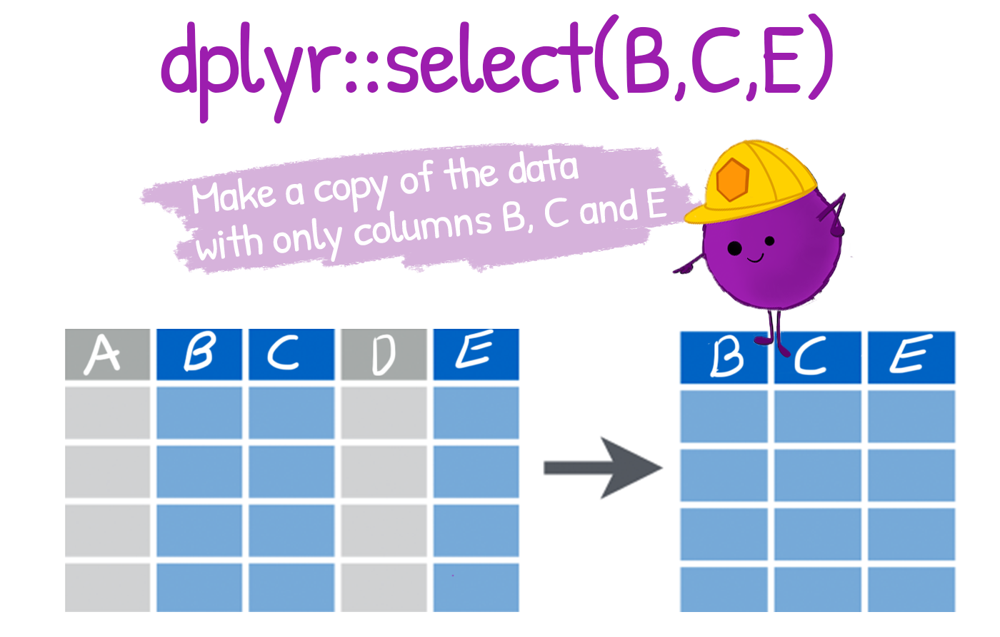

```{r, echo = F, message = F, warning = F}
# Load packages 
if(!require(pacman)) install.packages("pacman")
pacman::p_load(rlang, tidyverse, knitr, here, reactable, gt, flextable)

## functions
source(here::here("global/functions/lesson_functions.R"))
```

# Introduction {.unnumbered}

# Learning Objectives {.unnumbered}

1.  You can keep or drop columns from a data frame using the `select()` function from the {dplyr} package.

2.  You can select a range or combination of columns using operators like the colon (`:`), the exclamation mark (`!`), and the `c()` function.

# Packages

This lesson will require the following packages to be installed and loaded:

```{r warning = F, message = F, echo = F}
# Load packages 
if(!require(pacman)) install.packages("pacman")
pacman::p_load(tidyverse, here)

```

------------------------------------------------------------------------

# Introduction to the Dataset

In this lesson, we analyse results from a COVID-19 serological survey conducted in Yaounde, Cameroon in late 2020.

```{r render = .reactable_10_rows, message = FALSE}
yaounde <- read_csv(here("data/yaounde_data.csv"))
yaounde  
```

## Introducing `select()`



`dplyr::select()` lets you pick which columns (variables) to keep or drop from a data frame.

You can select a column *by name*:

```{r render = .reactable_5_rows}
yaounde %>% select(age) 
```

Or you can select a column *by position*:

```{r render = .reactable_5_rows}
yaounde %>% select(6)
```
