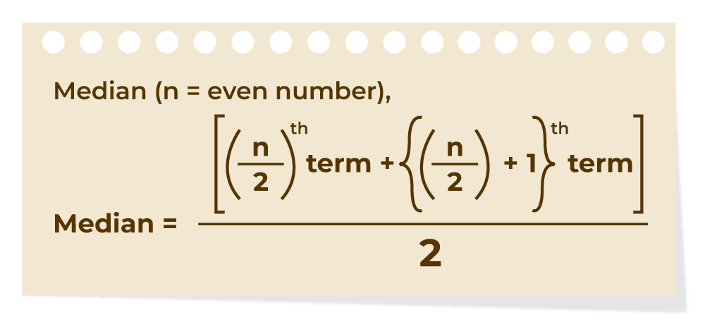
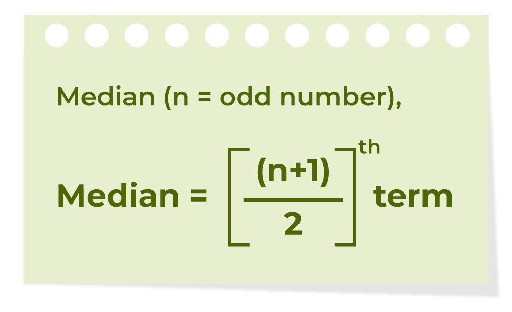

```{r, echo = F, message = F, warning = F}
# Load packages
if (!require(pacman)) install.packages("pacman")
pacman::p_load(rlang, tidyverse, knitr, here, reactable, gt, flextable)

# Source functions
source(here("global/functions/lesson_functions.R"))

# Knitr options
knitr::opts_chunk$set(
  warning = F, message = F,
  class.source = "tgc-code-block", error = T
)

# Set ggplot theme
theme_set(theme_minimal())
```

------------------------------------------------------------------------

# Introduction {.unnumbered}

In this lesson, we explore the fundamental concepts of **descriptive analysis**, focusing on:

-   **Types of Variables**: Numerical (continuous, discrete) and Categorical (ordinal, nominal)
-   **Measures of Central Tendency**: Mean, Median, Mode
-   **Basic Numerical and Graphical Summaries** for each type

# Learning Objectives {.unnumbered}

By the end of this lesson, you will be able to:

1.  Identify numerical and categorical variables and their subtypes.

2.  Compute and interpret measures of central tendency (mean, median, mode).

3.  Create appropriate numerical and graphical summaries for different variable types using R.

# Packages

This lesson will require the following packages to be installed and loaded:

```{r warning = F, message = F}
# Load packages
if (!require(pacman)) install.packages("pacman")
pacman::p_load(
  tidyverse,
  here,
  janitor,
  DescTools
)
```

------------------------------------------------------------------------

# Variable Types

When conducting descriptive analysis, the method you choose will depend on the *type* of data you’re analyzing. At the most basic level, variables can be described as numerical or categorical.


Numeric variables can then be further divided into **continuous** and **discrete** - the distinction being whether the variable can take on a continuum of values (e.g., height or weight), or only set of certain values (e.g., age or year).


Categorical variables can be subdivided into **ordinal** or **nominal** variables - depending on whether or not the categories can logically be ordered in a meaningful way.


# Methods of Descriptive analysis

Descriptive analysis of numerical variables can be measured by different methods (numerical or graphical) depending on the type of variable being summarized.

1.  **Numerical Variables**

    -   **Continuous**

        -   **Numerical methods** (e.g., mean, median, variance)

        -   **Graphical methods** (e.g., histogram, boxplot)

    -   **Discrete**

        -   **Numerical methods** (e.g., counts, proportions, discrete distributions)

        -   **Graphical methods** (e.g., bar charts, histograms with integer bins)

2.  **Categorical Variables**

    -   **Ordinal** (clear order, e.g., Likert scale: *poor*, *fair*, *good*)

        -   **Numerical methods** (e.g., frequencies, percentages)

        -   **Graphical methods** (e.g., bar chart with ordered categories)

    -   **Nominal** (no inherent order, e.g., gender, country)

        -   **Numerical methods** (e.g., frequencies, proportions)

        -   **Graphical methods** (e.g., bar chart, pie chart)

::: key-point
There are both **numerical** and **graphical** methods we can use to perform descriptive analysis for all types and subtypes of variables.


:::

------------------------------------------------------------------------

::: practice
**Identifying Variable Types**

For the four variables below, select whether it is numerical or categorical. If categorical, specify if it's ordinal or nominal. If numerical, classify as discrete or continuous.

1.  Stress level, responses are "high", "medium", "low".

2.  Age in years

3.  Height in centimeters

4.  Country name
:::

::: practice
**Identifying Variable Types**

If I measure age (in years) in a sample of 10,000 women, what type of variable would this be classified as?

1.  Continuous

2.  Binary

3.  Nominal

4.  Discrete
:::

# The Yaounde COVID-19 dataset

In this lesson, we analyse results from a COVID-19 serological survey conducted in Yaounde, Cameroon in late 2020. The survey estimated how many people had been infected with COVID-19 in the region, by testing for IgG and IgM antibodies. The full dataset can be obtained from [Zenodo](https://zenodo.org/record/5218965), and the paper can be viewed [here](https://www.nature.com/articles/s41467-021-25946-0).

Spend some time browsing through this dataset. Each line corresponds to one patient surveyed. There are some demographic, socio-economic and COVID-related variables. The results of the IgG and IgM antibody tests are in the columns `igg_result` and `igm_result`.

```{r message = F}
# Import data to RStudio
yaounde <- read_csv(here("data/yaounde_data.csv"))
```

```{r render = .reactable_5_rows, echo = F}
yaounde
```

Some examples of categorical variables seen in our `yaounde` data frame are: `sex`, `highest_education`, and `age_category`. In fact, most of the variables in this dataset are categorical.

```{r render = .reactable_5_rows}
head(yaounde)
```

Can you identify which variables are numeric? Of those, which are continuous and which are discrete? The `glimpse()` function can help us get a better look at this.

```{r}
glimpse(yaounde)
```

::: recap
**Review of the Main Data Classes in R**

R data classes correspond to different variable types:

| Variable Type | R Data Class                |
|---------------|-----------------------------|
| Continuous    | Numeric                     |
| Discrete      | Integer, Numeric            |
| Ordinal       | Factor (ordered), Character |
| Nominal       | Factor, Character           |
| Logical       | Logical (`TRUE` or `FALSE`) |
| Date          | Date                        |
:::

::: practice
**Identifying Variable Types and R Data classes**

For each of the following variables, identify (1) the variable type (categorical or numerical), (2) its subtype (e.g., nominal, ordinal, discrete, continuous), and (3) the corresponding R data class.

1.  `age`
2.  `highest_education`
3.  `is_smoker`
4.  `date_surveyed`
5.  `weight_kg`
6.  `igg_result`
:::

------------------------------------------------------------------------

# Categorical Variables

We’ll start by describing categorical variables, both numerically and graphically. As a reminder, categorical variables are variables whose values fit into distinct categories.

## Numerical Descriptions of Categorical Variables

We’ll begin our discussion of descriptive statistics in the categorical half of our flow chart. Specifically, we’ll start by numerically describing categorical variables.


The two most common numerical descriptions of categorical variables are probably the **frequency count** (you will often hear this referred to as simply the frequency, the count, or the n) and the **proportion or percentage** (the percentage is just the proportion multiplied by 100).

Using the `tabyl()` function from the `{janitor}` package, we can make frequency tables displaying the frequencies and percentages of categorical variable(s).

```{r}
# Make a frequency table of the `is_smoker` variable.

yaounde %>% tabyl(is_smoker)
```

The count (`n` column) is simply the number of observations, in this case deaths, which fall into each possible category.

The proportion (`percentage` column) is just the count divided by the total number of observations. In this example, almost 9 out of 10 deaths (.87 or 87%) died in a hospital or clinic.

We can also use the `tabyl()` function to create 2-way frequency tables.

```{r}
# Create a summary data frame of two categorical variables

yaounde %>%
  tabyl(is_smoker, sex)

yaounde %>%
  tabyl(is_smoker, sex) %>%
  adorn_percentages("row")
```

::: practice
**Frequency Tables**

Use the `tabyl()` function from the `{janitor}` package to answer the following:

1.  Create a frequency table of `has_contact_covid`.

```{r echo = F}
"YOUR ANSWER HERE"
```

2.  Create a two-way frequency table between `has_contact_covid` and `igg_result`.

```{r echo = F}
"YOUR ANSWER HERE"
```

3.  Use `adorn_percentages("row")` to display row-wise proportions in the table created above.

```{r echo = F}
"YOUR ANSWER HERE"
```
:::

## Graphical Descriptions of Categorical Variables

A **bar chart** is the simplest way to graphically describe the distribution of a categorical variable.

```{r}
ggplot(yaounde) +
  geom_bar(aes(x = is_smoker))
```

A **stacked bar chart** can help us visualize the distribution of two categorical variables.

```{r}
ggplot(yaounde) +
  geom_bar(aes(x = is_smoker, fill = sex))
```

A **percent-stacked bar chart** visualizes them as proportions rather than counts.

```{r}
ggplot(yaounde) +
  geom_bar(aes(x = is_smoker, fill = sex),
    position = "fill"
  )
```

**ADD BAR CHART OF ORDINAL VARIABLE WITH ORDERED CATEGORIES**

```{r}
ggplot(yaounde) +
  geom_bar(aes(x = highest_education))
```

```{r}
yaounde <- yaounde %>%
  mutate(
    highest_education =
      factor(highest_education,
        levels = c(
          "No formal instruction",
          "Primary",
          "Secondary",
          "University",
          "Doctorate",
          "No response"
        )
      )
  )
```

```{r}
ggplot(yaounde) +
  geom_bar(aes(x = highest_education))
```

```{r}
ggplot(yaounde) +
  geom_bar(aes(x = highest_education, fill = sex))
```

```{r}
ggplot(yaounde) +
  geom_bar(aes(x = highest_education, fill = sex),
    position = "fill"
  )

ggplot(yaounde) +
  geom_bar(aes(x = sex, fill = highest_education),
    position = "fill"
  )
```

::: practice
**Bar Charts**

Use `ggplot()` to create the following charts:

1.  Plot a bar chart showing the distribution of `age_category_3`, colored by `is_smoker`.

```{r echo = F}
"YOUR ANSWER HERE"
```

2.  Create a percent-stacked bar chart showing the same variables.

```{r echo = F}
"YOUR ANSWER HERE"
```

3.  Reorder the `age_category_3` factor so that the categories appear in the logical order (youngest to oldest) and then plot again.

```{r echo = F}
"YOUR ANSWER HERE"
```
:::

# Numerical Variables

In previous sections you’ve seen methods for describing categorical variables. Now we’ll switch over to describing numerical variables, both numerically and graphically.

## Numerical Descriptions of Numerical Variables: Measures of Central Tendency


In epidemiology, we often want to describe the “typical” person in a population with respect to some characteristic that is recorded as a numerical variable – like height or weight. The most basic, and probably most commonly used, way to do so is with a **measure of central tendency**.


In this chapter we’ll discuss three measures of central tendency:

-   **The mean**: The arithmetic average of the values.

-   **The median**: The middle value when data are sorted.

-   **The mode**: The most frequently occurring value(s).

Each of these have advantages and disadvantages, summarized in the chart below.


::: key-point
Measures of central tendency summarize the "center" of a numerical distribution. In public health, these measures help describe typical patient outcomes, average disease rates, and other key indicators.
:::

::: practice
**Measures of Central Tendency**

We measured the BMI of a group of individuals. Can you identify the median from the following values: 25, 24, 31, 38, 18, 14, 16, 25, 22, 25, 24, 27, 42, 30, 32?
:::

### Mean

**Mean** is the sum of all the values in the data set divided by the number of values in the data set. It is also called the Arithmetic Average. The Mean is denoted as x̅ and is read as **x bar**.

The formula to calculate the mean is:

.png)

We can perform this calculation with the `mean()` function from base R.

```{r}
# Demonstration using a single numerical variable: "height_cm"

mean_height <- mean(yaounde$height_cm)

mean_height
```

### Median

A Median is a middle value for sorted data. The sorting of the data can be done either in ascending order or descending order. A median divides the data into two halves.

The formula to calculate the **median** of the number of terms if the number of terms is even is shown in the image below:



The formula to calculate the median of the number of terms if the number of terms is odd is shown in the image below:



We can perform this calculation with the `median()` function from base R.

```{r}
median_height <- median(yaounde$height_cm)

median_height
```

### Mode

A mode is the most frequent value or item of the data set. There is no mode for a data set if every number appears only once.

.png)

Base R does not have a built-in function for calculating the mode, so we can use the `Mode()` function from the `{DescTools}` package.

```{r}
Mode(yaounde$height_cm)
```

::: watch-out
**Missing values when calculating measures of central tendency**

If there are missing values you can exclude them by adding “`na.rm = TRUE`”

```{r}
# Returns NA because there are missing values in this column
mean(yaounde$n_bedridden_days)
```

```{r}
# Sucessfully calculates the mean
mean(yaounde$n_bedridden_days, na.rm = TRUE)
```

The same applies to the `median()` and `Mode()` funtions.
:::

::: practice
**Calculating Measures of Central Tendency in R**

Use `mean()`, `median()`, and `Mode()` from `{DescTools}` to compute the following:

1.  Mean of `weight_kg`.

```{r echo = F}
"YOUR ANSWER HERE"
```

2.  Median of `n_days_miss_work` (be sure to handle missing values).

```{r echo = F}
"YOUR ANSWER HERE"
```

3.  Mode of `height_cm` and `n_bedridden_days`.

```{r echo = F}
"YOUR ANSWER HERE"
```
:::

### Differences between Mean, Median, and Mode

Mean, median, and mode are measures of central tendency in statistics.

| **Feature** | **Mean** | **Median** | **Mode** |
|:--:|:--:|:--:|:--:|
| **Definition** | Mean is the average of all values. | The median is the middle value when data is sorted. | Mode is the most frequently occurring value in the dataset. |
| **Sensitivity** | The mean is sensitive to outliers. | The median is not sensitive to outliers. | The mode is not sensitive to outliers. |
| **Calculation** | Calculated by adding up all values of a dataset and dividing them by the total number of values in the dataset. | Calculated by finding the middle value in a list of data. | Calculated by finding which value occurs more number of times in a dataset. |
| **Representation** | The value of themean may or may not be in the dataset. | Value of the median is always a value from the dataset. | The value of the mode is also always a value from the dataset. |

------------------------------------------------------------------------

## Graphical Summaries of Numerical Variables

Visualizations are essential in public health to communicate findings clearly. Two common plots for numerical data are **histograms** and **boxplots**.

### Histograms

A histogram shows how often values fall into specified bins or intervals. This is useful for checking skewness and identifying outliers.

A histogram visualizes the distribution of a numerical value as follows:

1.  We first cut up the x-axis into a series of *bins*, where each bin represents a range of values.

2.  For each bin, we count the number of observations that fall in the range corresponding to that bin.

3.  Then for each bin, we draw a bar whose length marks the corresponding count.

::: reminder
The function for creating histogram in `{ggplot2}` is **`geom_histogram()`**. We can use `fill` and `color` to enhance the appearance of the bars.
:::

Now let's use {ggplot2} to plot the distribution of heights, which is recorded in the `height_cm` column.

```{r}
# Simple histogram showing the distribution of height_cm
ggplot(
  data = yaounde,
  mapping = aes(x = height_cm)
) +
  geom_histogram(
    color = "white",
    fill = "steelblue", binwidth = 5
  ) +
  scale_x_continuous(
    breaks = scales::pretty_breaks(n = 12),
    expand = c(0, 0)
  ) +
  scale_y_continuous(expand = c(0, 0))
```

-   The histrogram shows up **how the probabilities of measurements are distributed**.

-   The tallest part of the histogram shows the region where measurements are more likely.

-   Most of the measurements come from people between 150 and 180 cm tall.

-   This is a slightly right-skewed distribution, probably because of a few children who are on the shorter side.

What if we filter out the children and plot the histogram again?

```{r}
# Create new df of only adults
yao_adults <- yaounde %>% filter(age_category_3 != "Child")

# Define base ggplot layers
yao_adults_height <- ggplot(
  data = yao_adults,
  mapping = aes(x = height_cm)
) +
  scale_x_continuous(
    breaks = scales::pretty_breaks(n = 12),
    expand = c(0, 0)
  ) +
  scale_y_continuous(expand = c(0, 0))

yao_adults_height +
  geom_histogram(
    color = "white",
    fill = "steelblue",
    binwidth = 5
  )
```

-   We have a much more normal distribution, which is what you would expect for a variable like height or weight.

-   Note the outliers: 2 adults under 140 cm.

We can vary the number of bins to get more or less detail from the histogram.

```{r}
# Try different numbers of bins

yao_adults_height +
  geom_histogram(
    bins = 5,
    color = "white",
    fill = "steelblue"
  )


yao_adults_height +
  geom_histogram(
    bins = 20,
    color = "white",
    fill = "cornflowerblue"
  )

yao_adults_height +
  geom_histogram(
    bins = 50,
    color = "white",
    fill = "dodgerblue"
  )
```

-   By using smaller bins, we get a more accurate and precise estimate of how heights are distributed.

### Density Curves

-   We can also represent continuous distributions with a smoothed curve, which is a useful alternative to the histogram.

-   We can use a curve to approximate the histogram by plotting it on top of the bars.

```{r}
yao_adults_height +
  geom_histogram(
    bins = 50,
    color = "white",
    fill = "dodgerblue",
    mapping = aes(y = after_stat(density))
  ) +
  geom_density(
    color = "indianred2",
    alpha = 0.25,
    linewidth = 1,
    bw = 3
  ) +
  geom_vline(aes(xintercept = mean(height_cm)),
    linetype = "dashed", linewidth = 1
  )
```

The curve tells us the same thing that the histogram tells us:

-   People shorter than 155 cm were relatively rare - i.e., there is a low probability that we will measure an adult shorter than 155 cm.

-   People taller than 175 cm were also relatively rare - i.e., there is a low probability that we will measure an adult taller than 175 cm.

The curve has a few advantages over the histogram.

-   For example, we don't have any values in the second-last bin, but we can use the curve to calculate the probability.

-   Furthermore, the curve is not limited by the width of the bins - we can use calculus to determine the probability of measuring someone between 172.5 and 183.7 cm, without having to round to the nearest bin size.

-   Lastly, if we have very few measurements, we can still approximate a curve using the mean and standard deviation of the few data points that we have.

```{r}
ggplot(
  data = sample_n(yao_adults, 100),
  mapping = aes(x = height_cm)
) +
  geom_histogram(
    bins = 50,
    color = "white",
    fill = "dodgerblue",
    mapping = aes(y = after_stat(density))
  ) +
  geom_density(
    color = "indianred2",
    alpha = 0.25,
    linewidth = 1,
    bw = 4
  ) +
  scale_x_continuous(
    breaks = scales::pretty_breaks(n = 12),
    expand = c(0, 0)
  ) +
  scale_y_continuous(expand = c(0, 0)) +
  geom_vline(aes(xintercept = mean(height_cm)),
    linetype = "dashed", linewidth = 1
  )
```

Try rerunning the code; each time will use a different random sample of 100 individuals from the dataset.

::: pro-tip
**Kernel density plots**

The **`geom_density()`** function draws kernel density estimates, which is a smoothed version of a histogram. This is a useful alternative to the histogram for continuous data.

By plotting separate overlapping curves for each sex, we can graphically describe how the distribution of heights varies between sexes.

```{r}
ggplot(yao_adults, aes(height_cm,
  colour = sex,
  fill = sex
)) +
  geom_density(alpha = 0.1)
```
:::

::: practice
**Histograms**

-   Plot a histogram showing the distribution of `n_bedridden_days` in `yaounde`.

```{r echo = F}
"YOUR ANSWER HERE"

ggplot(
  data = yaounde,
  mapping = aes(x = n_bedridden_days)
) +
  geom_histogram(
    color = "white",
    fill = "steelblue"
  )
```

Make notes on these key questions:

1.  What are the smallest and largest values?
2.  What are frequent and infrequent values?
:::

::: practice
**Density Plot: weight by sex**

-   Plot a kernel density plot showing the distribution of weight for each sex in `yaounde`.

```{r echo = F}
"YOUR ANSWER HERE"
```

Make notes on these key questions:

1.  What is the "center" or "most typical" value for each sex? How similar are the distributions?
2.  How do the values spread out? Is there a clear peak at the center?
:::

### Boxplots

A boxplot consists of two parts:

{alt="Anatomy of a boxplot" width="664"}

1.  **Box** --- Extends from the first to the third quartile (Q1 to Q3) with a line in the middle that represents the *median*. The range of values between Q1 and Q3 is also known as an *Interquartile range (IQR)*.

2.  **Whiskers** --- Lines extending from both ends of the box indicate variability outside Q1 and Q3. The minimum/maximum whisker values are calculated as $Q1 - 1.5 \times IQR$ to $Q3 + 1.5 \times IQR$ . Everything outside is represented as an *outlier* using dots or other markers.

::: reminder
The function for creating boxplots in {ggplot2} is **`geom_boxplot()`**. We can use `fill` argument inside the `aes()` function to color the boxes by a categorical variable.
:::

Let's start with a simple boxplot by mapping one numeric variable from `yaounde`, the height of patients (**`height_cm`**).

```{r}
# Simple boxplot of height_cm
ggplot(
  data = yaounde,
  mapping = aes(x = height_cm)
) +
  geom_boxplot()
```

To create a side-by-side boxplot (which is what we usually want), we need to add a categorical variable.

Let's compare life expectancy distributions between continents - i.e., split `height_cm` by the **`sex`** variable.

```{r}
ggplot(
  yaounde,
  aes(
    x = sex,
    y = height_cm,
    fill = sex
  )
) +
  geom_boxplot()
```

We can clearly see that there are notable differences in median height (central line of each box) between sexes. However, there is a lot of overlap between the range of values.

Boxplots have the limitation that they summarize the data into just five numbers: the 1st quartile, the median (the 2nd quartile), the 3rd quartile, and the upper and lower whiskers. By doing this, we might miss important characteristics of the data. One way to add more detail is to plot the individual observations as a **layer of points** on top of the boxplot with the **`geom_jitter()`** function.

```{r}
ggplot(
  yaounde,
  aes(
    x = sex,
    y = height_cm,
    fill = sex
  )
) +
  geom_boxplot() +
  geom_jitter(
    width = 0.25,
    alpha = 0.5
  )
```

Here, additional patterns become visible, such as variations and potential outliers within each sex group.

::: side-note
**Adding mean markers to a boxplot**

You may want to visualize the mean (average) value of the distributions on a boxplot.

We can do this by adding a statistics layer using the **`stat_summary()`** function.

```{r}
# Add a marker to show the mean
ggplot(
  yaounde,
  aes(
    x = sex, height_cm,
    y = height_cm,
    fill = sex,
    color = sex
  )
) +
  geom_boxplot(alpha = 0.6) +
  stat_summary(
    fun = "mean",
    geom = "point",
    size = 3,
    shape = 23,
    fill = "white"
  )
```
:::

::: practice
**Boxplots**

Create a boxplot showing the distribution of weights for each sex. Improve the plot by adding a layer of jittered points and a marker for the mean.

```{r echo = F}
"YOUR ANSWER HERE"
```
:::

::: practice
**Graphical methods for numeric variables**

We measured the age of 10,000 women in the UK. How would you suggest we look at the distribution of age across the sample population?

1.  Produce a bar chart, with age across the x-axis and frequency on the y-axis

2.  Produce a frequency table with all the ages in ascending order

3.  **Produce a histogram using age**

4.  Produce a bar chart, with age across the x-axis and gender across the y-axis

5.  Produce two histograms using age, one for men and one for women
:::

------------------------------------------------------------------------

# Key Takeaways {.unnumbered}

-   **Descriptive analysis** begins with identifying **variable types**: numerical vs. categorical, then diving deeper (continuous, discrete, ordinal, nominal).
-   **Measures of central tendency** (mean, median, mode) each have unique properties:
    -   **Mean** is sensitive to outliers.
    -   **Median** is more robust to skewness.
    -   **Mode** is always an observed value, but may not be unique or might not exist in certain distributions.
-   **Graphical summaries** (histograms, boxplots, bar charts) reveal patterns not always evident from numerical summaries alone.

Continue exploring these concepts with real-world data to gain deeper insight into public health analyses.

------------------------------------------------------------------------

# Answer Key {.unlisted .unnumbered}

**Identifying Variable Types**

For the four variables below, select whether it is numerical or categorical. If categorical, specify if it's ordinal or nominal. If numerical, classify as discrete or continuous.

1.  Stress level, responses are "high", "medium", "low". **Categorical – Ordinal**

2.  Age in years. **Numerical – Discrete**

3.  Height in centimeters. **Numerical – Continuous**

4.  Country name. **Categorical – Nominal**

**Identifying Variable Types**

If I measure age (in years) in a sample of 10,000 women, what type of variable would this be classified as? **Discrete**

**Identifying Variable Types and R Data Classes**

1.  `age` – **Numerical (Discrete), R class: Numeric**\
2.  `highest_education` – **Categorical (Ordinal), R class: Character or Factor**\
3.  `is_smoker` – **Categorical (Nominal), R class: Character**\
4.  `date_surveyed` – **Date, R class: Date**\
5.  `weight_kg` – **Numerical (Continuous), R class: Numeric**\
6.  `igg_result` – **Categorical (Nominal), R class: Character**

R data classes correspond to different variable types:

| Variable Type | R Data Class      | Example Variables in Yaounde Dataset |
|---------------|-------------------|--------------------------------------|
| Continuous    | Numeric           | `height_cm`, `weight_kg`             |
| Discrete      | Integer, Numeric  | `age`, `n_days_miss_work`            |
| Ordinal       | Factor (ordered)  | `highest_education`                  |
| Nominal       | Factor, Character | `sex`, `neighborhood`                |
| Logical       | Logical           | `is_pregnant`, `is_medicated`        |
| Date          | Date              | `date_surveyed`                      |

**Frequency Tables**

Use the `tabyl()` function from the `{janitor}` package to answer the following:

1.  Create a frequency table of `has_contact_covid`.

```{r}
yaounde %>% tabyl(has_contact_covid)
```

2.  Create a two-way frequency table between `has_contact_covid` and `igg_result`.

```{r}
yaounde %>% tabyl(
  has_contact_covid,
  igg_result
)
```

3.  Use `adorn_percentages("row")` to display row-wise proportions in the table created above.

```{r}
yaounde %>%
  tabyl(
    has_contact_covid,
    igg_result
  ) %>%
  adorn_percentages("row")
```

**Bar Charts**

Use `ggplot()` to create the following charts:

1.  Plot a bar chart showing the distribution of `age_category_3`, colored by `is_smoker`.

```{r}
ggplot(yaounde) +
  geom_bar(aes(x = age_category_3, fill = is_smoker))
```

2.  Create a percent-stacked bar chart showing the same variables.

```{r}
ggplot(yaounde) +
  geom_bar(aes(x = age_category_3, fill = is_smoker),
    position = "fill"
  )
```

3.  Reorder the `age_category_3` factor so that the categories appear in the logical order and then plot again.

```{r}
# Reorder categories from youngest to oldest
yaounde <- yaounde %>%
  mutate(
    age_category_3_ordered =
      factor(age_category_3,
        levels = c(
          "Child",
          "Adult",
          "Senior"
        )
      )
  )
```

```{r}
# Plot again with the ordered variable
ggplot(yaounde) +
  geom_bar(
    aes(
      x = age_category_3_ordered,
      fill = is_smoker
    ),
    position = "fill"
  )
```

**Caculating Measures of Central Tendency in R**

Use `mean()`, `median()`, and `Mode()` from `{DescTools}` to compute the following:

1.  Mean of `weight_kg`.

```{r}
mean(yaounde$weight_kg)
```

2.  Median of `n_days_miss_work` (be sure to handle missing values).

```{r}
mean(yaounde$n_days_miss_work, na.rm = TRUE)
```

3.  Mode of `height_cm` and `n_bedridden_days`.

```{r}
Mode(yaounde$height_cm)

Mode(yaounde$n_bedridden_days, na.rm = T)
```

**Histograms**

-   Plot a histogram showing the distribution of `n_bedridden_days` in `yaounde`.

```{r}
ggplot(
  data = yaounde,
  mapping = aes(x = n_bedridden_days)
) +
  geom_histogram(fill = "steelblue")
```

Make notes on these key questions:

1.  What are the smallest and largest values?
2.  What are frequent and infrequent values?

-   Smallest value is 0.\
-   Largest may be 30, but it is an outlier.\
-   Most frequent value is 0.\
-   Distribution is heavily left-skewed, with most patients having no or very few bedridden days.

**Density Plot: weight by sex**

-   Plot a kernel density plot showing the distribution of weight for each sex in `yaounde`.

```{r}
ggplot(yaounde, aes(weight_kg,
  colour = sex,
  fill = sex
)) +
  geom_density(alpha = 0.1)
```

-   Shows typical weight slightly differs by sex.\
-   Distributions largely overlap.
-   Distribution is bimodal - with two peaks. Perhaps one for children and one for adults.
-   Males have a slightly higher central tendency.

**Boxplots**

-   Create a boxplot showing the distribution of weights for each sex. Improve the plot by adding a layer of jittered points and a marker for the mean.

```{r}
"YOUR ANSWER HERE"

ggplot(
  yaounde,
  aes(
    x = sex,
    y = weight_kg,
    fill = sex,
    color = sex
  )
) +
  geom_boxplot(alpha = 0.6) +
  geom_jitter(width = 0.25, alpha = 0.5) +
  stat_summary(
    fun = "mean",
    geom = "point",
    size = 3,
    shape = 23,
    fill = "white"
  )
```

**Graphical methods for numeric variables**

We measured the age of 10,000 women in the UK. How would you suggest we look at the distribution of age across the sample population?

1.  Produce a bar chart, with age across the x-axis and frequency on the y-axis

2.  Produce a frequency table with all the ages in ascending order

3.  **Produce a histogram using age**

4.  Produce a bar chart, with age across the x-axis and gender across the y-axis

5.  Produce two histograms using age, one for men and one for women

# Appendix: R functions used in this lesson {.unlisted .unnumbered}

-   **Data Import & Setup**
    -   **`read_csv()`**\
        Reads CSV files into a data frame (from the **readr** package).
    -   **`here()`**\
        Constructs file paths relative to the project’s root (from the **here** package).
-   **Data Exploration & Inspection**
    -   **`glimpse()`**\
        Displays the structure of a data frame in a compact format (from **dplyr**/**tibble**).
    -   **`data()`**\
        Loads built-in or package datasets.
    -   **`head()`**\
        Shows the first few rows of a data frame.
-   **Data Manipulation & Summary**
    -   **`%>%`**\
        The pipe operator for chaining operations (from **magrittr** or **dplyr**).
    -   **`tabyl()`**\
        Creates frequency tables, showing counts (and can compute percentages) for categorical variables (from the **janitor** package).
    -   **`adorn_percentages()`**\
        Adds percentage calculations to frequency tables (from the **janitor** package).
-   **Descriptive Statistics**
    -   **`mean()`**\
        Computes the arithmetic mean.
    -   **`median()`**\
        Computes the median.
    -   **`Mode()`**\
        Calculates the mode (from the **DescTools** package).
-   **Data Visualization (using ggplot2)**
    -   **`ggplot()`**\
        Initializes a ggplot object.
    -   **`aes()`**\
        Sets up aesthetic mappings in ggplot2 plots.
    -   **`geom_bar()`**\
        Creates bar charts.
    -   **`geom_histogram()`**\
        Creates histograms.
    -   **`geom_density()`**\
        Creates kernel density plots.
    -   **`geom_boxplot()`**\
        Creates boxplots.
    -   **`geom_jitter()`**\
        Adds jittered points to a plot to show individual observations.
    -   **`stat_summary()`**\
        Adds summary statistics (e.g., mean markers) as a layer in a plot.
    -   **`reorder()`**\
        Reorders factor levels based on another variable (a base R function often used within aesthetic mappings).

# Contributors {.unlisted .unnumbered}

The following team members contributed to this lesson:

`r .tgc_contributors_list(ids = c("joy", "kendavidn"))`

# References {.unlisted .unnumbered}

Some material in this lesson was adapted from the following sources:

-   Irizarry, Rafael A. 2019. *Introduction to Data Science: Statistics and Prediction Algorithms Through Case Studies*. <https://rafalab.dfci.harvard.edu/dsbook-part-2/>.
-   Cannell, Brad, and Melvin Livingston. n.d. *R for Epidemiology*. <https://www.r4epi.com/>.
-   GeeksforGeeks. 2025. "Introduction of Statistics and Its Types." <https://www.geeksforgeeks.org/introduction-of-statistics-and-its-types/>.
-   Starmer, Josh. *StatQuest with Josh Starmer* [YouTube Channel]. <https://www.youtube.com/channel/UCtYLUTtgS3k1Fg4y5tAhLbw>.
-   The GRAPH Courses. *FoSSA: Fundamentals of Statistical Software & Analysis*. <https://thegraphcourses.org/courses/fossa/>.
-   University of Miami Libraries. *Introduction to Data Analysis and R*. <https://www.library.miami.edu/data-services/data-analysis.html>.

`r .tgc_license()`
