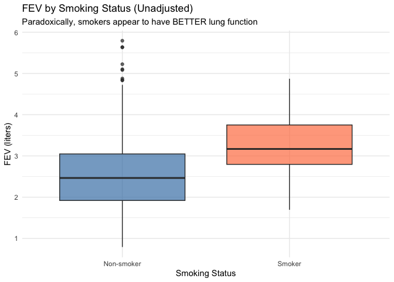
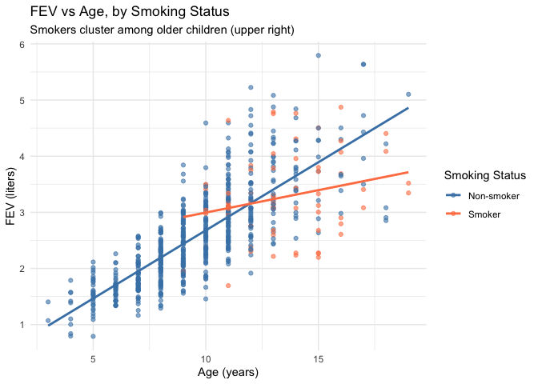
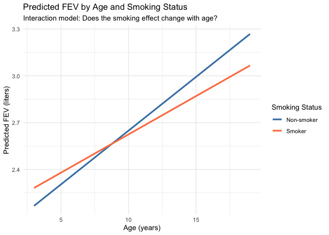

Confounding and Linear Regression: The FEV Dataset
================
The GRAPH Courses
2025-12-02

# Introduction

This lesson explores one of the most important concepts in epidemiology
and statistics: **confounding**. We’ll use the famous FEV (Forced
Expiratory Volume) dataset, which provides a classic example of
Simpson’s Paradox—where a statistical relationship appears to reverse
when controlling for a confounding variable.

## Learning Objectives

By the end of this lesson, you will be able to:

1.  Define confounding and identify potential confounders
2.  Recognize Simpson’s Paradox in real data
3.  Use regression to adjust for confounding variables
4.  Understand the difference between crude and adjusted estimates
5.  Explore interaction (effect modification) between variables

# The Dataset

The FEV dataset comes from a study of 654 children and adolescents (ages
3-19) in East Boston, Massachusetts, during the mid-1970s. The data was
collected to examine the relationship between smoking and lung function.

**Source:** Rosner, B. (1999). *Fundamentals of Biostatistics*, 5th Ed.
Pacific Grove, CA: Duxbury.

``` r
# Load required packages
library(ggplot2)
library(dplyr)
library(broom)
```

``` r
# Load the FEV dataset
fev <- read.csv("fev.csv")

# View the structure
str(fev)
```

    ## 'data.frame':    654 obs. of  5 variables:
    ##  $ Age   : int  9 8 7 9 9 8 6 6 8 9 ...
    ##  $ FEV   : num  1.71 1.72 1.72 1.56 1.9 ...
    ##  $ Height: num  57 67.5 54.5 53 57 61 58 56 58.5 60 ...
    ##  $ Sex   : int  0 0 0 1 1 0 0 0 0 0 ...
    ##  $ Smoke : int  0 0 0 0 0 0 0 0 0 0 ...

## Variable Descriptions

| Variable | Type | Description |
|----|----|----|
| `Age` | Numeric | Age in years (3-19) |
| `FEV` | Numeric | Forced Expiratory Volume in liters (lung capacity measure) |
| `Height` | Numeric | Height in inches |
| `Sex` | Binary | 0 = Female, 1 = Male |
| `Smoke` | Binary | 0 = Non-smoker, 1 = Current smoker |

**What is FEV?** Forced Expiratory Volume is the amount of air a person
can forcefully exhale in one second. It’s a key measure of lung
function—higher values generally indicate healthier lungs.

``` r
# Create labeled factor versions for clearer plots
fev <- fev %>%
  mutate(
    Sex_label = factor(Sex, levels = c(0, 1), labels = c("Female", "Male")),
    Smoke_label = factor(Smoke, levels = c(0, 1), labels = c("Non-smoker", "Smoker"))
  )

# Quick summary
summary(fev)
```

    ##       Age              FEV            Height           Sex        
    ##  Min.   : 3.000   Min.   :0.791   Min.   :46.00   Min.   :0.0000  
    ##  1st Qu.: 8.000   1st Qu.:1.981   1st Qu.:57.00   1st Qu.:0.0000  
    ##  Median :10.000   Median :2.547   Median :61.50   Median :1.0000  
    ##  Mean   : 9.931   Mean   :2.637   Mean   :61.14   Mean   :0.5138  
    ##  3rd Qu.:12.000   3rd Qu.:3.119   3rd Qu.:65.50   3rd Qu.:1.0000  
    ##  Max.   :19.000   Max.   :5.793   Max.   :74.00   Max.   :1.0000  
    ##      Smoke          Sex_label       Smoke_label 
    ##  Min.   :0.00000   Female:318   Non-smoker:589  
    ##  1st Qu.:0.00000   Male  :336   Smoker    : 65  
    ##  Median :0.00000                                
    ##  Mean   :0.09939                                
    ##  3rd Qu.:0.00000                                
    ##  Max.   :1.00000

# Part 1: The Paradox - Descriptive Statistics

Let’s start with a simple question: **Is smoking associated with lung
function?**

Based on what we know about smoking and health, we’d expect smokers to
have *worse* (lower) lung function. Let’s check the data:

``` r
# Calculate mean FEV by smoking status
fev %>%
  group_by(Smoke_label) %>%
  summarise(
    n = n(),
    mean_FEV = round(mean(FEV), 3),
    sd_FEV = round(sd(FEV), 3)
  )
```

    ## # A tibble: 2 × 4
    ##   Smoke_label     n mean_FEV sd_FEV
    ##   <fct>       <int>    <dbl>  <dbl>
    ## 1 Non-smoker    589     2.57  0.851
    ## 2 Smoker         65     3.28  0.75

## 🤔 Wait, What?

**Smokers have HIGHER average FEV than non-smokers!**

This is completely counterintuitive. Does smoking somehow *improve* lung
function? Of course not!

Let’s visualize this surprising finding:

``` r
ggplot(fev, aes(x = Smoke_label, y = FEV, fill = Smoke_label)) +
  geom_boxplot(alpha = 0.7) +
  scale_fill_manual(values = c("steelblue", "coral")) +
  labs(
    title = "FEV by Smoking Status (Unadjusted)",
    subtitle = "Paradoxically, smokers appear to have BETTER lung function",
    x = "Smoking Status",
    y = "FEV (liters)"
  ) +
  theme_minimal() +
  theme(legend.position = "none")
```

<!-- -->

This is a textbook example of **Simpson’s Paradox**—a phenomenon where a
trend that appears in groups of data reverses when the groups are
combined.

# Part 2: Investigating the Paradox

To understand this paradox, we need to ask: **Who smokes in this
dataset?**

Remember, these are children aged 3-19. Young children don’t smoke—it’s
primarily the older teenagers.

``` r
# Age distribution by smoking status
fev %>%
  group_by(Smoke_label) %>%
  summarise(
    n = n(),
    mean_age = round(mean(Age), 1),
    min_age = min(Age),
    max_age = max(Age)
  )
```

    ## # A tibble: 2 × 5
    ##   Smoke_label     n mean_age min_age max_age
    ##   <fct>       <int>    <dbl>   <int>   <int>
    ## 1 Non-smoker    589      9.5       3      19
    ## 2 Smoker         65     13.5       9      19

**Key insight:** Smokers are much older on average (about 13-14 years)
compared to non-smokers (about 9 years).

And who has bigger lungs? Older, bigger children!

``` r
# Correlation between age and FEV
cor(fev$Age, fev$FEV)
```

    ## [1] 0.756459

**Age is strongly positively correlated with FEV** (r ≈ 0.76). This
makes sense—lungs grow as children grow.

## The Confounding Mechanism

Let’s visualize the relationships:

``` r
ggplot(fev, aes(x = Age, y = FEV, color = Smoke_label)) +
  geom_point(alpha = 0.6) +
  geom_smooth(method = "lm", se = FALSE) +
  scale_color_manual(values = c("steelblue", "coral")) +
  labs(
    title = "FEV vs Age, by Smoking Status",
    subtitle = "Smokers cluster among older children (upper right)",
    x = "Age (years)",
    y = "FEV (liters)",
    color = "Smoking Status"
  ) +
  theme_minimal()
```

<!-- -->

Now the picture is clearer:

1.  **Smokers are concentrated among older children** (upper right of
    the plot)
2.  **Older children have larger FEV** (regardless of smoking)
3.  **At any given age**, smokers tend to have LOWER FEV than
    non-smokers

**Age is a confounder**—it’s associated with both the exposure (smoking)
and the outcome (FEV).

# Part 3: Understanding Confounding

## What is Confounding?

A **confounder** is a variable that:

1.  Is associated with the exposure (smoking status)
2.  Is independently associated with the outcome (FEV)
3.  Is NOT on the causal pathway between exposure and outcome

In our case:

           Age
          /   \
         ↓     ↓
      Smoke → FEV

Age influences both who smokes AND lung size, creating a spurious
positive association between smoking and FEV.

## Why Regression Helps

**Linear regression** allows us to estimate the effect of one variable
while **holding other variables constant**. By including Age in our
model, we can ask:

> “Among children of the **same age**, what is the association between
> smoking and FEV?”

# Part 4: Building Regression Models

## Model 1: Crude (Unadjusted) Model

First, let’s fit a simple regression with only smoking as a predictor:

``` r
# Crude model: FEV ~ Smoke
model_crude <- lm(FEV ~ Smoke, data = fev)
summary(model_crude)
```

    ## 
    ## Call:
    ## lm(formula = FEV ~ Smoke, data = fev)
    ## 
    ## Residuals:
    ##     Min      1Q  Median      3Q     Max 
    ## -1.7751 -0.6339 -0.1021  0.4804  3.2269 
    ## 
    ## Coefficients:
    ##             Estimate Std. Error t value Pr(>|t|)    
    ## (Intercept)  2.56614    0.03466  74.037  < 2e-16 ***
    ## Smoke        0.71072    0.10994   6.464 1.99e-10 ***
    ## ---
    ## Signif. codes:  0 '***' 0.001 '**' 0.01 '*' 0.05 '.' 0.1 ' ' 1
    ## 
    ## Residual standard error: 0.8412 on 652 degrees of freedom
    ## Multiple R-squared:  0.06023,    Adjusted R-squared:  0.05879 
    ## F-statistic: 41.79 on 1 and 652 DF,  p-value: 1.993e-10

**Interpretation:**

- The coefficient for `Smoke` is **positive** (~0.71)
- This suggests smokers have 0.71 liters higher FEV than non-smokers
- This is statistically significant (p \< 0.001)
- But this is **misleading** due to confounding!

## Model 2: Age-Adjusted Model

Now let’s control for age:

``` r
# Age-adjusted model: FEV ~ Smoke + Age
model_age <- lm(FEV ~ Smoke + Age, data = fev)
summary(model_age)
```

    ## 
    ## Call:
    ## lm(formula = FEV ~ Smoke + Age, data = fev)
    ## 
    ## Residuals:
    ##     Min      1Q  Median      3Q     Max 
    ## -1.6653 -0.3564 -0.0508  0.3494  2.0894 
    ## 
    ## Coefficients:
    ##              Estimate Std. Error t value Pr(>|t|)    
    ## (Intercept)  0.367373   0.081436   4.511 7.65e-06 ***
    ## Smoke       -0.208995   0.080745  -2.588  0.00986 ** 
    ## Age          0.230605   0.008184  28.176  < 2e-16 ***
    ## ---
    ## Signif. codes:  0 '***' 0.001 '**' 0.01 '*' 0.05 '.' 0.1 ' ' 1
    ## 
    ## Residual standard error: 0.5651 on 651 degrees of freedom
    ## Multiple R-squared:  0.5766, Adjusted R-squared:  0.5753 
    ## F-statistic: 443.3 on 2 and 651 DF,  p-value: < 2.2e-16

**The coefficient for Smoke has FLIPPED to negative!**

**Interpretation:**

- After controlling for age, smoking is associated with **-0.21 liters**
  lower FEV
- Comparing children of the **same age**, smokers have worse lung
  function
- This is the **correct** interpretation!

## Model 3: Fully Adjusted Model

Let’s add Height and Sex for better precision:

``` r
# Fully adjusted model
model_full <- lm(FEV ~ Smoke + Age + Height + Sex, data = fev)
summary(model_full)
```

    ## 
    ## Call:
    ## lm(formula = FEV ~ Smoke + Age + Height + Sex, data = fev)
    ## 
    ## Residuals:
    ##      Min       1Q   Median       3Q      Max 
    ## -1.37656 -0.25033  0.00894  0.25588  1.92047 
    ## 
    ## Coefficients:
    ##              Estimate Std. Error t value Pr(>|t|)    
    ## (Intercept) -4.456974   0.222839 -20.001  < 2e-16 ***
    ## Smoke       -0.087246   0.059254  -1.472    0.141    
    ## Age          0.065509   0.009489   6.904 1.21e-11 ***
    ## Height       0.104199   0.004758  21.901  < 2e-16 ***
    ## Sex          0.157103   0.033207   4.731 2.74e-06 ***
    ## ---
    ## Signif. codes:  0 '***' 0.001 '**' 0.01 '*' 0.05 '.' 0.1 ' ' 1
    ## 
    ## Residual standard error: 0.4122 on 649 degrees of freedom
    ## Multiple R-squared:  0.7754, Adjusted R-squared:  0.774 
    ## F-statistic:   560 on 4 and 649 DF,  p-value: < 2.2e-16

**Key findings from the full model:**

``` r
# Nice table of coefficients
tidy(model_full, conf.int = TRUE) %>%
  mutate(across(where(is.numeric), ~round(., 4)))
```

    ## # A tibble: 5 × 7
    ##   term        estimate std.error statistic p.value conf.low conf.high
    ##   <chr>          <dbl>     <dbl>     <dbl>   <dbl>    <dbl>     <dbl>
    ## 1 (Intercept)  -4.46      0.223     -20.0    0      -4.89     -4.02  
    ## 2 Smoke        -0.0872    0.0593     -1.47   0.141  -0.204     0.0291
    ## 3 Age           0.0655    0.0095      6.90   0       0.0469    0.0841
    ## 4 Height        0.104     0.0048     21.9    0       0.0949    0.114 
    ## 5 Sex           0.157     0.0332      4.73   0       0.0919    0.222

**Interpretation:**

1.  **Smoke (-0.087)**: After adjusting for age, height, and sex,
    smokers have about 0.09 liters lower FEV. However, note this is not
    statistically significant at α = 0.05.

2.  **Age (0.066)**: Each additional year of age is associated with
    0.066 liters higher FEV, holding other variables constant.

3.  **Height (0.104)**: Each additional inch in height is associated
    with 0.104 liters higher FEV—the strongest predictor.

4.  **Sex (0.157)**: Males have 0.157 liters higher FEV than females of
    the same age and height.

## Comparing the Models

``` r
# Compare smoking coefficients across models
comparison <- data.frame(
  Model = c("Crude", "Age-adjusted", "Fully adjusted"),
  Smoke_coefficient = c(
    coef(model_crude)["Smoke"],
    coef(model_age)["Smoke"],
    coef(model_full)["Smoke"]
  ),
  R_squared = c(
    summary(model_crude)$r.squared,
    summary(model_age)$r.squared,
    summary(model_full)$r.squared
  )
)

comparison %>%
  mutate(across(where(is.numeric), ~round(., 3)))
```

    ##            Model Smoke_coefficient R_squared
    ## 1          Crude             0.711     0.060
    ## 2   Age-adjusted            -0.209     0.577
    ## 3 Fully adjusted            -0.087     0.775

The smoking coefficient changes dramatically:

- **+0.71** in crude model (confounded—wrong direction!)
- **-0.21** in age-adjusted model (correct direction)
- **-0.09** in fully adjusted model (attenuated due to Height absorbing
  some variance)

This is a textbook demonstration of **negative confounding**—where
confounding bias makes an effect appear in the opposite direction.

# Part 5: Interaction (Effect Modification)

## Does the smoking effect differ by age?

Perhaps the harmful effect of smoking accumulates over time—older
smokers might show more damage. Let’s test for interaction:

``` r
# Interaction model: Smoke * Age
model_interact_age <- lm(FEV ~ Smoke * Age + Height + Sex, data = fev)
summary(model_interact_age)
```

    ## 
    ## Call:
    ## lm(formula = FEV ~ Smoke * Age + Height + Sex, data = fev)
    ## 
    ## Residuals:
    ##     Min      1Q  Median      3Q     Max 
    ## -1.3615 -0.2519  0.0117  0.2492  1.9112 
    ## 
    ## Coefficients:
    ##             Estimate Std. Error t value Pr(>|t|)    
    ## (Intercept) -4.41539    0.22853 -19.321  < 2e-16 ***
    ## Smoke        0.17401    0.32234   0.540     0.59    
    ## Age          0.06887    0.01033   6.668 5.57e-11 ***
    ## Height       0.10296    0.00499  20.634  < 2e-16 ***
    ## Sex          0.15974    0.03337   4.787 2.10e-06 ***
    ## Smoke:Age   -0.01980    0.02401  -0.825     0.41    
    ## ---
    ## Signif. codes:  0 '***' 0.001 '**' 0.01 '*' 0.05 '.' 0.1 ' ' 1
    ## 
    ## Residual standard error: 0.4123 on 648 degrees of freedom
    ## Multiple R-squared:  0.7756, Adjusted R-squared:  0.7739 
    ## F-statistic: 447.9 on 5 and 648 DF,  p-value: < 2.2e-16

**Interpretation of interaction:**

- The `Smoke:Age` interaction term tells us if the effect of smoking
  changes with age
- A negative interaction would suggest the gap between smokers and
  non-smokers widens with age

## Visualizing the Interaction

``` r
# Create predictions for visualization
age_range <- seq(min(fev$Age), max(fev$Age), by = 0.5)
pred_data <- expand.grid(
  Age = age_range,
  Smoke = c(0, 1),
  Height = mean(fev$Height),
  Sex = 0.5  # Average between males and females
)

pred_data$predicted_FEV <- predict(model_interact_age, newdata = pred_data)
pred_data$Smoke_label <- factor(pred_data$Smoke, levels = c(0, 1), 
                                 labels = c("Non-smoker", "Smoker"))

ggplot(pred_data, aes(x = Age, y = predicted_FEV, color = Smoke_label)) +
  geom_line(linewidth = 1.2) +
  scale_color_manual(values = c("steelblue", "coral")) +
  labs(
    title = "Predicted FEV by Age and Smoking Status",
    subtitle = "Interaction model: Does the smoking effect change with age?",
    x = "Age (years)",
    y = "Predicted FEV (liters)",
    color = "Smoking Status"
  ) +
  theme_minimal()
```

<!-- -->

## Does the smoking effect differ by sex?

``` r
# Interaction model: Smoke * Sex
model_interact_sex <- lm(FEV ~ Smoke * Sex + Age + Height, data = fev)
summary(model_interact_sex)
```

    ## 
    ## Call:
    ## lm(formula = FEV ~ Smoke * Sex + Age + Height, data = fev)
    ## 
    ## Residuals:
    ##      Min       1Q   Median       3Q      Max 
    ## -1.38404 -0.25547  0.00456  0.24666  1.93203 
    ## 
    ## Coefficients:
    ##              Estimate Std. Error t value Pr(>|t|)    
    ## (Intercept) -4.421924   0.222835 -19.844  < 2e-16 ***
    ## Smoke       -0.183075   0.074189  -2.468 0.013857 *  
    ## Sex          0.135409   0.034638   3.909 0.000102 ***
    ## Age          0.065990   0.009465   6.972 7.73e-12 ***
    ## Height       0.103734   0.004750  21.840  < 2e-16 ***
    ## Smoke:Sex    0.234147   0.109605   2.136 0.033032 *  
    ## ---
    ## Signif. codes:  0 '***' 0.001 '**' 0.01 '*' 0.05 '.' 0.1 ' ' 1
    ## 
    ## Residual standard error: 0.4111 on 648 degrees of freedom
    ## Multiple R-squared:  0.7769, Adjusted R-squared:  0.7752 
    ## F-statistic: 451.4 on 5 and 648 DF,  p-value: < 2.2e-16

# Part 6: Model Diagnostics

Let’s verify our main model meets the assumptions of linear regression:

``` r
par(mfrow = c(2, 2))
plot(model_full)
```

<!-- -->

**Assessment:**

1.  **Residuals vs Fitted**: Reasonable scatter, slight curve suggests
    possible non-linearity
2.  **Q-Q Plot**: Residuals approximately normal
3.  **Scale-Location**: Fairly constant variance
4.  **Residuals vs Leverage**: No extreme influential points

# Summary

## Key Takeaways

1.  **Simpson’s Paradox is real**: Raw comparisons showed smokers with
    *better* lung function—a completely misleading result.

2.  **Confounding can reverse apparent effects**: Age was a confounder
    that created a spurious positive association between smoking and
    FEV.

3.  **Regression adjusts for confounding**: By including Age in the
    model, we revealed that smoking is actually associated with *lower*
    FEV.

4.  **The importance of thinking causally**: Before running any
    analysis, we should draw out our hypothesized causal relationships
    (DAGs) and identify potential confounders.

## Clinical/Public Health Implications

- Never trust unadjusted comparisons in observational data
- Always consider what variables might confound your exposure-outcome
  relationship
- Statistical adjustment via regression is a powerful tool, but it
  requires careful thought about the causal structure

# Exercises

1.  **Subgroup Analysis**: Split the data into children under 10 and
    adolescents 10+. Does the crude association between smoking and FEV
    differ between groups? Why?

2.  **Prediction**: Using the full model, what FEV would you predict for
    a 15-year-old male who smokes and is 66 inches tall?

3.  **Model Selection**: Use `AIC()` to compare the model with and
    without the interaction term. Which model is preferred?

4.  **Methods Section Practice**: Write a 2-paragraph methods section
    describing the statistical analysis you would use to examine the
    relationship between smoking and FEV while controlling for
    confounders.

# References

Kahn, M. (2003). Data Sleuth. *STATS*, 37, 24.

Rosner, B. (1999). *Fundamentals of Biostatistics*, 5th Ed. Pacific
Grove, CA: Duxbury.

Tager, I. B., Weiss, S. T., Rosner, B., & Speizer, F. E. (1979). Effect
of parental cigarette smoking on the pulmonary function of children.
*American Journal of Epidemiology*, 110(1), 15-26.
