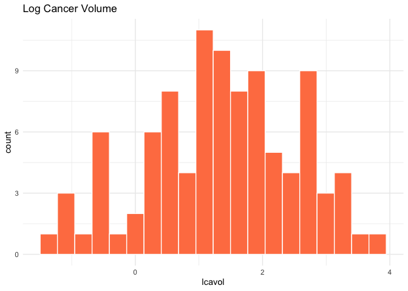
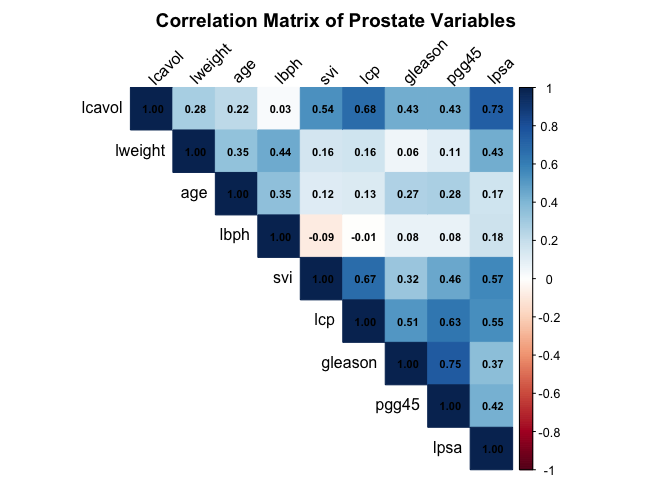
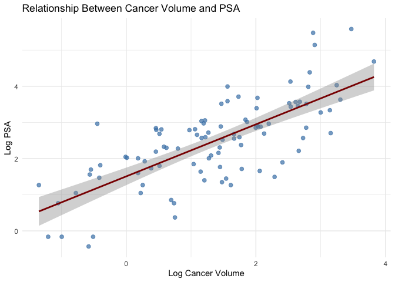

Linear Regression with Prostate Cancer Data
================
The GRAPH Courses
2025-12-02

# Introduction

In this lesson, we will analyze a classic dataset from prostate cancer
research. Our goal is to understand what factors are associated with
**prostate-specific antigen (PSA)** levels—a key biomarker used in
prostate cancer diagnosis and monitoring.

We’ll progress from exploratory data analysis through to building and
interpreting a linear regression model.

## Learning Objectives

By the end of this lesson, you will be able to:

1.  Summarize and visualize continuous and categorical variables
2.  Examine relationships between variables using correlation
3.  Understand the basic concepts of linear regression
4.  Fit and interpret a multiple linear regression model in R

# The Dataset

The `prostate` dataset comes from a study by Stamey et al. (1989), which
examined the relationship between PSA and several clinical measures in
97 men about to receive a radical prostatectomy.

``` r
# Load required packages
library(genridge) # Contains the prostate dataset
library(ggplot2) # For visualization
library(dplyr) # For data manipulation
library(corrplot) # For correlation visualization
```

``` r
# Load the dataset
data(prostate)

# View the first few rows
head(prostate)
```

    ##       lcavol  lweight age      lbph svi       lcp gleason pgg45       lpsa
    ## 1 -0.5798185 2.769459  50 -1.386294   0 -1.386294       6     0 -0.4307829
    ## 2 -0.9942523 3.319626  58 -1.386294   0 -1.386294       6     0 -0.1625189
    ## 3 -0.5108256 2.691243  74 -1.386294   0 -1.386294       7    20 -0.1625189
    ## 4 -1.2039728 3.282789  58 -1.386294   0 -1.386294       6     0 -0.1625189
    ## 5  0.7514161 3.432373  62 -1.386294   0 -1.386294       6     0  0.3715636
    ## 6 -1.0498221 3.228826  50 -1.386294   0 -1.386294       6     0  0.7654678
    ##   train
    ## 1  TRUE
    ## 2  TRUE
    ## 3  TRUE
    ## 4  TRUE
    ## 5  TRUE
    ## 6  TRUE

## Variable Descriptions

| Variable  | Description                                        |
|-----------|----------------------------------------------------|
| `lcavol`  | Log of cancer volume                               |
| `lweight` | Log of prostate weight                             |
| `age`     | Age in years                                       |
| `lbph`    | Log of benign prostatic hyperplasia amount         |
| `svi`     | Seminal vesicle invasion (1 = yes, 0 = no)         |
| `lcp`     | Log of capsular penetration                        |
| `gleason` | Gleason score (a measure of cancer aggressiveness) |
| `pgg45`   | Percentage of Gleason scores 4 or 5                |
| `lpsa`    | **Log of PSA** (our outcome variable)              |
| `train`   | Training/test set indicator                        |

Note: Several variables are log-transformed (indicated by “l” prefix) to
normalize their distributions.

# Part 1: Descriptive Statistics

Let’s start by exploring our data. We’ll remove the `train` variable
since it’s just a data split indicator.

``` r
# Remove the train indicator for our analysis
prostate_clean <- prostate %>% select(-train)

# Check dimensions
dim(prostate_clean)
```

    ## [1] 97  9

## Summary Statistics

``` r
# Get summary statistics for all variables
summary(prostate_clean)
```

    ##      lcavol           lweight           age             lbph        
    ##  Min.   :-1.3471   Min.   :2.375   Min.   :41.00   Min.   :-1.3863  
    ##  1st Qu.: 0.5128   1st Qu.:3.376   1st Qu.:60.00   1st Qu.:-1.3863  
    ##  Median : 1.4469   Median :3.623   Median :65.00   Median : 0.3001  
    ##  Mean   : 1.3500   Mean   :3.629   Mean   :63.87   Mean   : 0.1004  
    ##  3rd Qu.: 2.1270   3rd Qu.:3.876   3rd Qu.:68.00   3rd Qu.: 1.5581  
    ##  Max.   : 3.8210   Max.   :4.780   Max.   :79.00   Max.   : 2.3263  
    ##       svi              lcp             gleason          pgg45       
    ##  Min.   :0.0000   Min.   :-1.3863   Min.   :6.000   Min.   :  0.00  
    ##  1st Qu.:0.0000   1st Qu.:-1.3863   1st Qu.:6.000   1st Qu.:  0.00  
    ##  Median :0.0000   Median :-0.7985   Median :7.000   Median : 15.00  
    ##  Mean   :0.2165   Mean   :-0.1794   Mean   :6.753   Mean   : 24.38  
    ##  3rd Qu.:0.0000   3rd Qu.: 1.1787   3rd Qu.:7.000   3rd Qu.: 40.00  
    ##  Max.   :1.0000   Max.   : 2.9042   Max.   :9.000   Max.   :100.00  
    ##       lpsa        
    ##  Min.   :-0.4308  
    ##  1st Qu.: 1.7317  
    ##  Median : 2.5915  
    ##  Mean   : 2.4784  
    ##  3rd Qu.: 3.0564  
    ##  Max.   : 5.5829

Let’s also look at the structure:

``` r
str(prostate_clean)
```

    ## 'data.frame':    97 obs. of  9 variables:
    ##  $ lcavol : num  -0.58 -0.994 -0.511 -1.204 0.751 ...
    ##  $ lweight: num  2.77 3.32 2.69 3.28 3.43 ...
    ##  $ age    : int  50 58 74 58 62 50 64 58 47 63 ...
    ##  $ lbph   : num  -1.39 -1.39 -1.39 -1.39 -1.39 ...
    ##  $ svi    : int  0 0 0 0 0 0 0 0 0 0 ...
    ##  $ lcp    : num  -1.39 -1.39 -1.39 -1.39 -1.39 ...
    ##  $ gleason: int  6 6 7 6 6 6 6 6 6 6 ...
    ##  $ pgg45  : int  0 0 20 0 0 0 0 0 0 0 ...
    ##  $ lpsa   : num  -0.431 -0.163 -0.163 -0.163 0.372 ...

## Visualizing the Outcome Variable

Our outcome of interest is `lpsa` (log PSA). Let’s visualize its
distribution:

``` r
ggplot(prostate_clean, aes(x = lpsa)) +
    geom_histogram(bins = 20, fill = "steelblue", color = "white") +
    labs(
        title = "Distribution of Log PSA Levels",
        x = "Log PSA",
        y = "Count"
    ) +
    theme_minimal()
```

<!-- -->

The distribution appears roughly normal, which is good for linear
regression.

## Visualizing Key Predictors

Let’s look at the distribution of some key predictors:

``` r
# Cancer volume
p1 <- ggplot(prostate_clean, aes(x = lcavol)) +
    geom_histogram(bins = 20, fill = "coral", color = "white") +
    labs(title = "Log Cancer Volume", x = "lcavol") +
    theme_minimal()

# Age
p2 <- ggplot(prostate_clean, aes(x = age)) +
    geom_histogram(bins = 15, fill = "seagreen", color = "white") +
    labs(title = "Age Distribution", x = "Age (years)") +
    theme_minimal()

# Display plots
p1
```

<!-- -->

``` r
p2
```

<!-- -->

## Examining a Binary Predictor

`svi` (seminal vesicle invasion) is a binary variable. Let’s see how
it’s distributed:

``` r
prostate_clean %>%
    count(svi) %>%
    mutate(
        svi_label = ifelse(svi == 1, "Yes", "No"),
        percentage = round(n / sum(n) * 100, 1)
    )
```

    ##   svi  n svi_label percentage
    ## 1   0 76        No       78.4
    ## 2   1 21       Yes       21.6

Most patients (about 79%) did not have seminal vesicle invasion.

# Part 2: Exploring Relationships

## Correlation Analysis

Before building a regression model, let’s examine the correlations
between variables:

``` r
# Calculate correlation matrix
cor_matrix <- cor(prostate_clean)

# Display rounded correlation matrix
round(cor_matrix, 2)
```

    ##         lcavol lweight  age  lbph   svi   lcp gleason pgg45 lpsa
    ## lcavol    1.00    0.28 0.22  0.03  0.54  0.68    0.43  0.43 0.73
    ## lweight   0.28    1.00 0.35  0.44  0.16  0.16    0.06  0.11 0.43
    ## age       0.22    0.35 1.00  0.35  0.12  0.13    0.27  0.28 0.17
    ## lbph      0.03    0.44 0.35  1.00 -0.09 -0.01    0.08  0.08 0.18
    ## svi       0.54    0.16 0.12 -0.09  1.00  0.67    0.32  0.46 0.57
    ## lcp       0.68    0.16 0.13 -0.01  0.67  1.00    0.51  0.63 0.55
    ## gleason   0.43    0.06 0.27  0.08  0.32  0.51    1.00  0.75 0.37
    ## pgg45     0.43    0.11 0.28  0.08  0.46  0.63    0.75  1.00 0.42
    ## lpsa      0.73    0.43 0.17  0.18  0.57  0.55    0.37  0.42 1.00

``` r
# Visualize the correlation matrix
corrplot(cor_matrix,
    method = "color", type = "upper",
    tl.col = "black", tl.srt = 45,
    addCoef.col = "black", number.cex = 0.7,
    title = "Correlation Matrix of Prostate Variables",
    mar = c(0, 0, 2, 0)
)
```

<!-- -->

**Key observations:**

- `lcavol` (log cancer volume) has the strongest correlation with `lpsa`
  (r = 0.73)
- `lcp` (log capsular penetration) also has a moderate positive
  correlation with `lpsa`
- Some predictors are correlated with each other (e.g., `lcavol` and
  `lcp`)

## Scatterplot: Cancer Volume vs PSA

Let’s visualize the relationship between our strongest predictor and the
outcome:

``` r
ggplot(prostate_clean, aes(x = lcavol, y = lpsa)) +
    geom_point(alpha = 0.7, color = "steelblue", size = 2) +
    geom_smooth(method = "lm", se = TRUE, color = "darkred") +
    labs(
        title = "Relationship Between Cancer Volume and PSA",
        x = "Log Cancer Volume",
        y = "Log PSA"
    ) +
    theme_minimal()
```

<!-- -->

There’s a clear positive linear relationship: as cancer volume
increases, so does PSA level.

# Part 3: Understanding Linear Regression

## What is Linear Regression?

**Linear regression** is a statistical method for modeling the
relationship between:

- A **dependent variable** (outcome): what we want to predict or explain
- One or more **independent variables** (predictors): factors that might
  influence the outcome

The basic equation for simple linear regression is:

``` math
Y = \beta_0 + \beta_1 X + \epsilon
```

Where:

- $`Y`$ = dependent variable (outcome)
- $`X`$ = independent variable (predictor)
- $`\beta_0`$ = intercept (value of Y when X = 0)
- $`\beta_1`$ = slope (change in Y for one-unit change in X)
- $`\epsilon`$ = error term (random variation)

## Multiple Linear Regression

When we have multiple predictors, the equation extends to:

``` math
Y = \beta_0 + \beta_1 X_1 + \beta_2 X_2 + ... + \beta_p X_p + \epsilon
```

This allows us to:

1.  **Control for confounding**: See the effect of one variable while
    holding others constant
2.  **Improve prediction**: Use multiple sources of information
3.  **Understand relative importance**: Compare which factors matter
    most

## Key Assumptions

Linear regression assumes:

1.  **Linearity**: Relationships between predictors and outcome are
    linear
2.  **Independence**: Observations are independent of each other
3.  **Homoscedasticity**: Residuals have constant variance
4.  **Normality**: Residuals are approximately normally distributed

# Part 4: Building the Regression Model

## Simple Linear Regression

Let’s start with a simple model using only `lcavol` as a predictor:

``` r
# Fit simple linear regression
simple_model <- lm(lpsa ~ lcavol, data = prostate_clean)

# View the summary
summary(simple_model)
```

    ## 
    ## Call:
    ## lm(formula = lpsa ~ lcavol, data = prostate_clean)
    ## 
    ## Residuals:
    ##      Min       1Q   Median       3Q      Max 
    ## -1.67624 -0.41648  0.09859  0.50709  1.89672 
    ## 
    ## Coefficients:
    ##             Estimate Std. Error t value Pr(>|t|)    
    ## (Intercept)  1.50730    0.12194   12.36   <2e-16 ***
    ## lcavol       0.71932    0.06819   10.55   <2e-16 ***
    ## ---
    ## Signif. codes:  0 '***' 0.001 '**' 0.01 '*' 0.05 '.' 0.1 ' ' 1
    ## 
    ## Residual standard error: 0.7875 on 95 degrees of freedom
    ## Multiple R-squared:  0.5394, Adjusted R-squared:  0.5346 
    ## F-statistic: 111.3 on 1 and 95 DF,  p-value: < 2.2e-16

### Interpreting the Output

- **Intercept (1.507)**: When log cancer volume is 0, the predicted log
  PSA is 1.507
- **lcavol coefficient (0.719)**: For each 1-unit increase in log cancer
  volume, log PSA increases by 0.719 units on average
- **R-squared (0.539)**: Log cancer volume alone explains about 54% of
  the variation in log PSA
- **p-value (\<2e-16)**: The relationship is highly statistically
  significant

## Multiple Linear Regression

Now let’s include all predictors:

``` r
# Fit multiple linear regression with all predictors
full_model <- lm(lpsa ~ ., data = prostate_clean)

# View the summary
summary(full_model)
```

    ## 
    ## Call:
    ## lm(formula = lpsa ~ ., data = prostate_clean)
    ## 
    ## Residuals:
    ##      Min       1Q   Median       3Q      Max 
    ## -1.76644 -0.35510 -0.00328  0.38087  1.55770 
    ## 
    ## Coefficients:
    ##              Estimate Std. Error t value Pr(>|t|)    
    ## (Intercept)  0.181561   1.320568   0.137  0.89096    
    ## lcavol       0.564341   0.087833   6.425 6.55e-09 ***
    ## lweight      0.622020   0.200897   3.096  0.00263 ** 
    ## age         -0.021248   0.011084  -1.917  0.05848 .  
    ## lbph         0.096713   0.057913   1.670  0.09848 .  
    ## svi          0.761673   0.241176   3.158  0.00218 ** 
    ## lcp         -0.106051   0.089868  -1.180  0.24115    
    ## gleason      0.049228   0.155341   0.317  0.75207    
    ## pgg45        0.004458   0.004365   1.021  0.31000    
    ## ---
    ## Signif. codes:  0 '***' 0.001 '**' 0.01 '*' 0.05 '.' 0.1 ' ' 1
    ## 
    ## Residual standard error: 0.6995 on 88 degrees of freedom
    ## Multiple R-squared:  0.6634, Adjusted R-squared:  0.6328 
    ## F-statistic: 21.68 on 8 and 88 DF,  p-value: < 2.2e-16

### Interpreting the Results

Looking at the coefficients:

``` r
# Extract and display coefficients nicely
coef_table <- summary(full_model)$coefficients
coef_df <- data.frame(
    Variable = rownames(coef_table),
    Estimate = round(coef_table[, 1], 4),
    Std_Error = round(coef_table[, 2], 4),
    t_value = round(coef_table[, 3], 2),
    p_value = round(coef_table[, 4], 4)
)
coef_df
```

    ##                Variable Estimate Std_Error t_value p_value
    ## (Intercept) (Intercept)   0.1816    1.3206    0.14  0.8910
    ## lcavol           lcavol   0.5643    0.0878    6.43  0.0000
    ## lweight         lweight   0.6220    0.2009    3.10  0.0026
    ## age                 age  -0.0212    0.0111   -1.92  0.0585
    ## lbph               lbph   0.0967    0.0579    1.67  0.0985
    ## svi                 svi   0.7617    0.2412    3.16  0.0022
    ## lcp                 lcp  -0.1061    0.0899   -1.18  0.2412
    ## gleason         gleason   0.0492    0.1553    0.32  0.7521
    ## pgg45             pgg45   0.0045    0.0044    1.02  0.3100

**Key findings:**

1.  **`lcavol` (p \< 0.001)**: Log cancer volume is the strongest
    predictor. Each unit increase in lcavol is associated with a 0.56
    unit increase in lpsa, holding other variables constant.

2.  **`lweight` (p = 0.003)**: Log prostate weight is significantly
    associated with lpsa. Larger prostates tend to have higher PSA
    levels.

3.  **`svi` (p = 0.002)**: Seminal vesicle invasion is significantly
    associated with higher PSA. Patients with SVI have, on average, 0.76
    higher log PSA than those without.

4.  **Non-significant predictors**: `age`, `lbph`, `lcp`, `gleason`, and
    `pgg45` are not statistically significant when controlling for other
    variables.

## Model Fit Statistics

``` r
# R-squared values
cat("R-squared:", round(summary(full_model)$r.squared, 3), "\n")
```

    ## R-squared: 0.663

``` r
cat("Adjusted R-squared:", round(summary(full_model)$adj.r.squared, 3), "\n")
```

    ## Adjusted R-squared: 0.633

The model explains about 65% of the variance in log PSA levels.

# Part 5: Model Diagnostics

We should check whether our model meets the assumptions of linear
regression.

``` r
# Create diagnostic plots
par(mfrow = c(2, 2))
plot(full_model)
```

<!-- -->

**Interpreting the diagnostic plots:**

1.  **Residuals vs Fitted**: Points should be randomly scattered
    around 0. Our plot looks reasonable—no obvious patterns.

2.  **Normal Q-Q**: Points should follow the diagonal line. Our
    residuals appear approximately normal.

3.  **Scale-Location**: Points should be randomly spread. We see fairly
    constant variance (homoscedasticity).

4.  **Residuals vs Leverage**: Helps identify influential points. No
    observations appear to have extreme influence.

# Part 6: Comparing Models

Let’s compare our simple and full models:

``` r
# Compare R-squared
cat("Simple model R-squared:", round(summary(simple_model)$r.squared, 3), "\n")
```

    ## Simple model R-squared: 0.539

``` r
cat("Full model R-squared:", round(summary(full_model)$r.squared, 3), "\n")
```

    ## Full model R-squared: 0.663

``` r
cat(
    "\nImprovement:",
    round((summary(full_model)$r.squared - summary(simple_model)$r.squared) * 100, 1),
    "percentage points\n"
)
```

    ## 
    ## Improvement: 12.4 percentage points

Adding the additional predictors improved our model’s explanatory power
from 54% to 65%.

## ANOVA Comparison

``` r
# Formal comparison with ANOVA
anova(simple_model, full_model)
```

    ## Analysis of Variance Table
    ## 
    ## Model 1: lpsa ~ lcavol
    ## Model 2: lpsa ~ lcavol + lweight + age + lbph + svi + lcp + gleason + 
    ##     pgg45
    ##   Res.Df    RSS Df Sum of Sq      F    Pr(>F)    
    ## 1     95 58.915                                  
    ## 2     88 43.058  7    15.856 4.6295 0.0001902 ***
    ## ---
    ## Signif. codes:  0 '***' 0.001 '**' 0.01 '*' 0.05 '.' 0.1 ' ' 1

The F-test shows that the additional predictors significantly improve
the model (p \< 0.001).

# Summary

In this lesson, we:

1.  **Explored the data** using summary statistics and visualizations
2.  **Examined correlations** between variables to understand
    relationships
3.  **Learned the basics of linear regression** and its assumptions
4.  **Built and interpreted regression models** to identify factors
    associated with PSA levels
5.  **Checked model diagnostics** to validate our results

**Key clinical takeaways:**

- **Cancer volume** is the strongest predictor of PSA levels
- **Prostate weight** and **seminal vesicle invasion** are also
  significantly associated with PSA
- Other clinical measures (age, Gleason score, etc.) don’t add
  significant predictive value when the above factors are already in the
  model

# Exercises

1.  Try fitting a model with only the significant predictors (`lcavol`,
    `lweight`, `svi`). How does its R-squared compare to the full model?

2.  Create a scatterplot of `lweight` vs `lpsa`. Does the relationship
    look linear?

3.  What would you predict for the log PSA of a patient with
    `lcavol = 2`, `lweight = 3.5`, and `svi = 1`?

# References

Stamey, T., Kabalin, J., McNeal, J., Johnstone, I., Freiha, F., Redwine,
E. and Yang, N. (1989). Prostate specific antigen in the diagnosis and
treatment of adenocarcinoma of the prostate II. Radical prostatectomy
treated patients. *Journal of Urology*, 16: 1076–1083.
